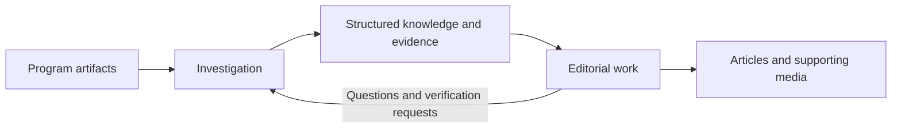

# Architecture and vocabulary

Read the [manifest](01-purpose.md) first. This document defines the concepts,
component responsibilities and direction of the system. The
[contracts](03-contracts.md) specify how those parts must behave.

**Status vocabulary:** **Implemented** describes an existing component or
workflow, not a guarantee that every contract is satisfied. **Planned** names
an intended capability or direction. **Unresolved** identifies a decision that
must be made before it can become an implementation requirement. Experiment
reports and decision records describe their own point in time.

## 1. Investigation and editorial work

re64 supports two connected activities:

**Implemented:** projects hold interpretations and evidence; analysis and
machine runs produce observations and captures. Experiments demonstrate people
and agents producing HTML articles and media from that work.

**Planned:** editorial work is a supported product workflow with the same
standing as knowledge production. It includes drafting, reviewing, selecting
evidence, preparing media and publishing an intelligible account.

**Unresolved:** how article drafts are represented and edited, where revision
history lives, how article passages reference project evidence, and how a
publication records the versions it relies on. The existing HTML experiment is
a workflow example, not an article schema. This architecture does not choose
whether article drafts belong in the project CRDT, separate documents or files.

## 2. Concepts and names

The vocabulary spans several concerns. Naming a concept does not imply that it
needs a new entity, persistent id or CRDT root:

| Concern | Terms used here | Where their details belong |
|---|---|---|
| Purpose and product | Software archaeology, investigation, article, published edition | Manifest and product direction in this architecture |
| Domain knowledge | Project, layer, target, claim, evidence, type | Concept definitions here; current data shapes in the model reference |
| Collaboration | Participant, replica, operation, changeset, merge | Ownership here; obligations in the contracts |
| Runtime and representation | MCP session, browser tab, room, workspace, Y.Doc, Project projection | Components and ownership here; storage mappings in the model reference |

An article is a product concept with an unresolved representation. A replica is
an independently editable copy, not an extra entity within the knowledge it
holds. A project is the domain body of knowledge; a Y.Doc represents one copy
of its shared state. Those meanings should not be used interchangeably.

| Concept | Meaning |
|---|---|
| **Artifact** | Material being investigated: a program file, disk image, memory dump or related historical source. |
| **Project** | The persistent investigation: its resources, interpretations, experiments and collaboration record. |
| **File / blob** | A project file names binary content; a blob is the stored byte sequence identified by its content hash. A filename and a content hash answer different questions. |
| **Layer** | A declared source of bytes or symbols. PRG, raw, inline-byte and ROM layers supply bytes; a symbols layer supplies annotations. |
| **Target** | A named arrangement of linked layers defining a memory view for analysis or execution. A target can describe a loader image, runtime image or another useful configuration. |
| **Link / placement** | Inclusion of a layer in a target, with its placement and stacking order. |
| **Address / offset / frame** | An address locates a byte in a target; an offset locates it relative to a resource. A frame specifies which reference system a location uses. None identifies an interpretation. |
| **Claim** | An interpretation about a location or range: for example, a name, a record layout or a decoding entry point. Several claims may concern the same bytes. |
| **Evidence** | An account supporting, refuting or retiring a claim, carrying provenance and optionally references to a scenario, capture or another claim. |
| **Provenance** | Who supplied an account, how they reached it and, when recorded, when they did so. It belongs to evidence rather than being a confidence score on a claim. |
| **Constant / type / field / decoder** | Reusable descriptions of values and data. A field has its own identity within a type; a decoder interprets bytes through sandboxed code. |
| **Binding** | A choice associating a use site with a declaration, such as a constant use or primary name. It differs from creating that declaration. |
| **Scenario** | A stored sequence of machine actions and checks, run with a selected target and concrete inputs. |
| **Capture** | A recorded output of a scenario step, with associated bytes such as an image, trace or memory dump. A capture becomes support for a claim through an evidence relationship. |
| **Article** | An edited account for a reader, selecting findings and evidence into a narrative. Its draft representation is unresolved. |
| **Published edition** | The article and supporting material as released to readers. How to retain its evidence references and inputs is unresolved. |

Use **target** for the selected memory arrangement. The existing claim field
named `view` means a rendering format, such as `char:8` or `sprite`; it does not
select a target. Avoid using an unqualified “view” where either meaning fits.
Targets may distinguish shipped, decrunched, loader-stage or patched program
images; these can contain different bytes, rather than merely present the same
bytes differently. Keep `Target` as the current model/API term. “Program image”
is a useful description of some arrangements, not a schema rename or an entity
that this document introduces.

## 3. State and representations

The concepts above have several representations, with different jobs:

| Representation | Responsibility | Implementation |
|---|---|---|
| Shared document | Mergeable investigation state, including entities and references | Yjs, encapsulated in `src/core/crdt/` |
| Project projection | Plain domain data used by analysis, rendering and serialization | `Project`, `projectFromDoc` |
| Loaded project / memory map | The selected target with its actual byte sources and placements | `src/core/project/`, `src/core/memory/` |
| Analysis and machine results | Derived findings, rendered rows and execution outputs | `src/core/analysis/`, `src/core/view/`, `src/core/machine/` |
| Durable storage | Snapshots, updates, operation history, blobs and session metadata | `src/store/`, primarily SQLite |
| `.re64` file | Import/export representation; also supported by the existing file-backed store | Project parser and serializer, `FileStorage` |
| Article and media | An edited publication built from selected findings | Currently experiment HTML and associated assets |

These representations are not interchangeable. A project projection does not
contain the full collaboration state. An exported file does not contain all
database history or every external input. A document version identifies a
projection; it is not by itself an execution fingerprint or a publication
version. Derived caches are disposable, while a capture deliberately retained
as evidence is a persistent artifact.

Use **projection** for the plain data derived from a document, **database
snapshot** for persisted CRDT state used in reconstruction, and **machine
checkpoint** for cached execution state. Calling all three a snapshot would
hide their different inputs and persistence requirements. The shared document
is authoritative for mergeable knowledge; blobs and durable operation history
have separate persistence responsibilities. They cannot all be reconstructed
from the current project projection. Disposable caches must be distinguished
from these retained resources.

## 4. Components and responsibilities

| Component | Responsibility | Boundary |
|---|---|---|
| Domain model and operations (`src/core/`) | Describe programs and apply explicit edits | Browser-safe code; CRDT mechanics stay in the CRDT adapter |
| CRDT adapter (`src/core/crdt/`) | Translate operations and project data to/from mergeable state | Owns Yjs representation, projection and document migration |
| Analysis, execution and rendering | Interpret byte sources, run scenarios and derive presentations | Report assumptions and unsupported behavior; do not silently promote a result into an accepted claim |
| Store (`src/store/`) | Persist documents, operations, blobs and history | Owns persistence boundaries, import/export and reconstruction |
| Client/session layer (`src/client/`) | Maintain a participant's local replica and connection | Separates local edits and receipt of other participants' changes |
| Server and workspace (`src/server/`) | Coordinate rooms, request context, selected targets, caches and domain workflows | Captures caller/session identity and supplies concrete inputs to the core |
| MCP (`src/server/mcp/`) | Provide task-oriented tools for agents | Schemas and receipts must agree with the operations they expose |
| HTTP and WebSocket endpoints | Transfer resources, expose lower-level actions and synchronize documents | Transport mechanisms; they do not define a second domain model |
| Web UI (`src/ui/`) | Let people explore, edit and inspect the investigation | Shares core concepts and rendering; feature parity with MCP is not assumed |
| Editorial workflow | Turn findings and evidence into reviewed articles and media | Presently demonstrated in experiments; dedicated article components are unresolved |

The investigation has three access surfaces: MCP, HTTP and the web UI.
These are distinct from its two outputs: structured knowledge and articles.
An article reader need not operate the investigation interface.

## 5. Collaboration vocabulary

A **participant** is a person or agent contributing to a project. A **user id**
attributes contributions. A **session** identifies one period or channel of
work; it is not a user, a target or a saved machine. A **replica** is a local
copy of shared state. A server **room** coordinates access to one project, and
a **workspace** provides domain workflows with a particular request context.

The current ownership relationships are:

| Owner/context | State held | Implementation anchor |
|---|---|---|
| Browser/client session | Local document replica and synchronization connection | `src/client/session.ts`, `src/client/doc-client.ts` |
| MCP session, per project | Server-held session replica, shared by its target-specific workspaces | `replicaFor` in `src/server/index.ts` |
| Project room | Store's shared document and synchronization service | `src/server/index.ts`, `src/server/sync.ts` |
| Workspace | Request context and derived caches; references the room and optional session replica | `src/server/workspace.ts` |

One participant can have several sessions and replicas. A user id does not
identify a unique replica, and changing targets within an MCP session does not
create an independent copy of the project. Workspaces without a session replica
read the room. This ownership table does not imply uniform visibility across
all session paths; the known gap is stated below.

An **operation** expresses one domain edit. A **changeset** groups operations
as one user action. A **CRDT update** transports mergeable state changes. A
**database transaction** defines a local persistence boundary. These are
different units: grouping operations does not make their distributed execution
atomic, and receiving an update is not the same event as committing it durably.

**Design requirement: freshness is not correctness.** An MCP session may keep
working from its existing replica without first receiving other sessions'
changes. Being connected does not require a merge before every read or write;
the session explicitly decides when to import that work. Names resolve against
what the author knows, and the resulting operation carries that meaning into
the merge. Working from an older copy may duplicate investigation effort or
produce competing names for one routine. Preserving those contributions is
expected behavior, not grounds to reject the operation or discard a claim.
The session's own successful edits must remain visible to it.

This is the intended MCP receipt policy, not a promise that current paths all
implement it. Browser clients can receive updates continuously. Neither this
policy nor the offline contract promises that a server-side MCP session lease
or replica survives indefinitely after disconnection. The outstanding session
repair below must make reads, edits and undo consistent with this requirement.

**Implemented:** the browser/client and MCP session machinery use replicas,
and the server records user/session attribution. **Unresolved:** a consistent
visibility policy across every MCP read, edit and undo path is tracked in
[#28](https://github.com/re64/re64/issues/28). Existing session behavior must not
be treated as a settled specification. [#35](https://github.com/re64/re64/pull/35)
proposes a repair; when it lands, update this section, the status table below
and contract S1 to describe the merged behavior and its verification.
The next document states the sync and
durability obligations using these terms.

## 6. Status and design boundaries

| Area | Status and next decision |
|---|---|
| Structured investigation | Implemented: claims, declarations, scenarios, captures and evidence are represented and exposed through tools. |
| Article production | Demonstrated through experiments; a supported editorial workflow is planned. Storage, editing, references and publication versioning remain unresolved. |
| Claim and binding coordinates | Claim frames exist; completing the coordinate model for bindings is tracked in [#26](https://github.com/re64/re64/issues/26). |
| File references | Content-addressed blobs exist; file identity and stable references from layers/captures remain [#27](https://github.com/re64/re64/issues/27). Do not describe the current filename references as immutable identities. |
| Session consistency | Replicas exist; uniform visibility and undo behavior remain [#28](https://github.com/re64/re64/issues/28). |
| Edit schema consistency | The operation contract distinguishes omission from clear; the general surface audit remains [#29](https://github.com/re64/re64/issues/29). |

For exact field shapes, use the [model reference](05-model.md). For edit
semantics, use the [operation algebra](06-algebra.md). The
[generated MCP reference](07-api.md) describes the callable schema. Keep those
details out of this document unless they change a component boundary or a
concept's meaning.

## 7. Maintaining the documentation

The numbered files establish a reading order: purpose, architecture, contracts,
developer workflows, model reference, operation reference, API reference and
experiments. `decisions/` is an append-only historical archive; its filenames
identify subjects rather than a required reading sequence.

Each kind of information has one primary documentation home:

| Question | Owner | Other documents should |
|---|---|---|
| Why does re64 exist, and what does it produce? | [01 · Manifest](01-purpose.md) | Link to the goal |
| What do the terms mean, who owns state, and what is planned? | This architecture | Use its vocabulary and status |
| What must hold, and what verifies it? | [03 · Contracts](03-contracts.md) | Cite the contract identifier |
| How do I carry out a task or implement a change? | [04 · Developer guide](04-developer-guide.md) | Link to the worked workflow |
| What data is represented, and what reads it? | [05 · Model reference](05-model.md) | Link to its shape and implementation anchors |
| What does an edit mean? | [06 · Operation algebra](06-algebra.md) | Cite its mutation/replacement boundary |
| What arguments does a tool accept? | [07 · Generated API](07-api.md) | Give small examples, not duplicate schemas |
| What happened in a run, or why did a design change? | [08 · Experiments](08-experiments.md), [decision archive](decisions/README.md) | Link to dated evidence |

Short reminders and examples are useful; parallel specifications are not.
Keep repair narratives in the archive and short bug origins with their
contracts. The model reference should describe the current representation
without requiring a reader to reconstruct its history.

When changing a concept or component boundary, update this architecture. When
changing an obligation, update its contract and verification. Generate the API
reference from the live schema. Record reasons and superseded alternatives in
the decision archive, then link to them rather than copying their history into
each guide. Code establishes what is implemented; discrepancies with stated
contracts need an explicit fix or design decision, not an implicit exception.
