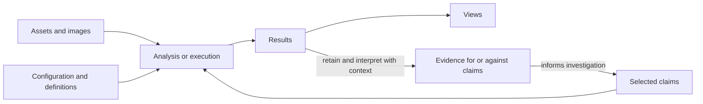

# Architecture

An investigation moves between reading software, running it, and making sense of
what happened. re64 keeps the material and the growing account together, so a
finding can lead to another experiment or become part of an article.

The [manifest](01-purpose.md) explains why. This document introduces the main
concepts, their relationships, and the behavior they must support. The
[design register](03-design-register.md) leads to separate documents and issues
for choosing representations, storage, synchronization, and tool interfaces.
The immediate subject is the C64; other machines can test a design choice without
becoming a support commitment.

We use "The Revenge of the Mutant Camels" by Jeff Minter (1984) as a running
example throughout this document.

## 1. Projects and their material

A **project** is the home of an investigation. It brings together assets,
knowledge, articles, and a conversation between people and agents.

**Assets** supply the material: binaries, ROMs, cartridges, disks, and data
extracted or produced along the way. Each asset is identifiable within the project
and can be used in multiple images and analyses. Assets can also be investigated
in their own right.
Reading a file, comparing ranges, decoding a picture, or inspecting a disk's
allocation map does not require constructing a running machine. Unnamed or
deleted material is as legitimate a subject as a directory file.

An asset's contents and its placement in memory are distinct. A file can suggest
a load address without determining where a program actually loads it. Locations
within an asset remain identifiable when it is placed elsewhere. Extraction,
copying, and transformation preserve enough context to trace the resulting
material back to its sources.

> **Mutant Camels — two builds.** The investigation includes a 1984 binary and
> a disk containing Jeff Minter's 2021 collision fix. The fix changes existing
> instructions and adds code at `$C000`. Studying both builds requires keeping
> their material distinguishable while comparing what changed.
> [Build comparison][builds]

## 2. Images and configuration

Analysis of program behavior concerns machine state, which may only be partially
known. An **image** represents that state, whether constructed from assets or
reached through execution. Each analysis uses the information it needs and makes
its assumptions explicit.

An image can carry everything needed to continue execution: memory, registers,
device state, banking controls, attached hardware, and inserted media, including
the state of connected devices. Some state may be unknown or supplied by
defaults. A default provides a concrete value; an unknown leaves a question for
the analysis. Tools explain when missing state prevents them from continuing.

Memory includes the underlying storage hidden by the current bank selection.
The machine's **mapping** determines which memory or device an access reaches.
The address, access kind, accessing processor or device, and current state all
matter. Reads and writes at the same address can reach different storage.

Loading and execution can overwrite bytes. These changes affect the selected
storage but preserve the source assets. The resulting bytes remain traceable to
their origins, including later writes. Overlapping material and hidden memory
must remain distinguishable.

A **configuration** specifies the state and assumptions chosen for an analysis: which material to place, the interpretations to use, and the conditions of an experiment. These choices need not describe a state the original program ever reached or could reach. A useful configuration can be retained; a temporary query need not create a named image merely to examine an alternative.

When an examination starts from an image and applies configured changes, the
resulting machine state must be explicit and interpreted consistently across
tools. Results identify that state and its assumptions, while the retained
starting image continues to represent its original state.

> **Mutant Camels — getting past the loader.** The disk version is compressed.
> Running its decruncher prepares the expanded game for investigation. An image
> captured at that point preserves the resulting memory and machine state as
> an input to further analysis. [Decrunching recipe][recipe]

### C64 support and platform knowledge

A **platform** supplies the machine behavior and associated resources used by an
analysis or execution. Selecting it is part of configuration. Its hardware and
ROM knowledge uses the same descriptive facilities as knowledge developed within
a project.

Platform knowledge can provide ROM labels and routine descriptions even when the ROM bytes are unavailable. Inspecting or executing the ROM itself requires its contents.

> **Mutant Camels — PRNG from BASIC ROM.** The game's random-byte routine
> increments a counter and reads from `$A000 + counter`, using BASIC ROM as a
> lookup table. An experiment supplied substitute bytes and observed the game.
> Those contents are part of the experiment's conditions and limit what its
> gameplay images establish. [ROM experiment][relations]

## 3. Analysis and execution

**Analysis** examines material and behavior to discover structure, relationships,
and possible explanations. It can inspect an asset, reason about an image, or
compare results across several assets and states.

Static analysis follows control flow from **entry points** and code selected for
inspection. A function is designated at an entry location; its discovered
body can occupy several disjoint ranges. Its incoming state depends on how
execution reaches it. Instructions, basic blocks, and functions can cross asset
boundaries, and overlapping instruction readings remain inspectable.

**Abstract interpretation** reasons about possible behavior with partly known
values, following registers, memory, flags, the stack, and control-flow paths.
**Effects** summarize what a block or function may read or write, including the
behavior it reaches. Reference queries and stack analysis help explain how data
and control move through the program. Unsupported instructions and unresolved
accesses remain visible as limits of the result.

An experiment examines a question about behavior under chosen conditions.
A **scenario** describes inputs, checks, and actions as execution proceeds;
a **run** records one execution under those conditions. Scenarios can react to time, an instruction
being reached, an access, or a condition on machine state. Actions can provide
input, change media, modify state, and retain observations.

Deliberate interventions include substituting a routine, forcing a predicate,
or controlling random values. They are useful ways to isolate behavior even
when faithful platform emulation is available. Their presence and effect belong
in the run's record, alongside its initial state and inputs.

A **checkpoint** is an image captured during execution, usable for another run
or analysis. A **capture** retains an observation, such as a memory dump,
screenshot, or recording of device activity. An **access trace** records which
instructions read, wrote, or fetched bytes and which storage or device they
reached. A trace explains activity; a checkpoint preserves state.

Runtime observations can inform subsequent analysis. They retain the conditions
under which they were observed: an executed target is evidence of that execution,
and an unobserved target is not thereby impossible.

> **KERNAL ROM — overlapping instructions.** In its error handling, the bytes
> `2C A9 02` read as `BIT $02A9`. Enter one byte later and `A9 02` reads as
> `LDA #$02`. Both readings belong in the analysis.
> [Instruction example][overlap]

## 4. Knowledge and interpretations

A **claim** records something a participant wants the investigation to consider
true. It has a **subject** and an **assertion** about that subject. Subjects can
include locations, functions, assets, and relationships; an address is not
required. Claims can be tentative, supported, disputed, or withdrawn.

Claims express the project's knowledge, including tentative and disputed
interpretations. They can describe one subject or apply across several assets,
images, and broader contexts without repeated entry. Association with an asset
does not confine a claim's subject to that asset's bytes: its code may act
elsewhere in the machine.

Claims may be conditional: an assertion can depend on the material, machine
state, execution context, or other stated conditions. **Applicability** concerns
whether its subject and conditions match a particular examination. That match
may be established by evidence, assumed for the examination, disputed, or
unresolved. An analysis can use a claim under an explicit assumption even when
its applicability or truth remains uncertain;
the results retain that assumption. Selecting a claim for analysis does not
verify or endorse it, and reuse does not independently verify it at each use.

### Constants, types, records, and bindings

**Constants** name values. **Types** define ways to interpret data. A **record type**
describes fields, their positions, and their types, including numbers,
pointers, text, bit fields, arrays, and nested records. Unknown portions can
remain holes. Constant and type definitions are configuration; claims applying
them express knowledge.

A **record** is particular material interpreted as an instance of a record type.
Its fields can be inspected and referenced during exploration, without first
recording a claim that the interpretation is correct. Reusable decoders express
custom formats and identify any additional inputs their interpretation needs.

A change to a constant or type can affect many uses. re64 helps participants find
those uses, review the impact, and apply corrections collectively. Updating an
interpretation does not mean it has been verified. Evidence identifies the
material and definition examined, so a later edit does not make an earlier
result appear to verify the revised interpretation.

A **binding** associates a use with what it refers to: an asset, location, label,
constant, type, record, or field. The same numeric value can have different
meanings at different uses. A participant can choose a binding for an analysis
or assert it in a claim; analysis can also infer one from addresses, context,
and typed regions. Tools distinguish these choices, assertions, and inferred
results.

Bindings can also connect data across separate tables. Several arrays may
describe different properties of the same object using a shared index,
while a value in a table may identify a picture or file asset through the
program's file-selection rules. Such an identifier need not be a memory address.
These connections let tools follow and annotate references while preserving the
encoded values. Identifying an asset does not specify where or when it is loaded.

> **Mutant Camels — a table becomes a structure.** An 8,400-byte region contains
> 42 records of 200 bytes, each with a 40-character name at offset `$A0`.
> A `ZoneRecord` type makes that structure reusable and leaves unexplained
> portions visible. It also gives references a readable path such as
> `zoneTable[0].name`. [Record analysis][zones]

### Interpreting surviving material

Claims can describe unused fragments, spillover, duplicates, and possible older
revisions. Comparisons and investigator-developed tools can provide evidence
for those readings. Classifying a region can explain its origin without proving
that it has no effect on execution.

An interpretation does not remove loaded bytes or prevent behavioral analysis
from following accesses into them. A listing or search can filter material
explicitly, with the filtering visible and the material still available.
Choosing one label for display likewise does not settle competing assertions.

## 5. Evidence, correction, and investigative progress

**Provenance** records who added a claim or other contribution and where
it came from, such as an asset or analysis result. **Evidence** explains
why an assertion should be believed or questioned. A claim can be recorded
before evidence is attached.

Evidence can refer to source locations, execution captures, recorded reasoning,
and retained analytical results. Comparisons, searches, table queries,
consistency scripts, and visualizations all produce useful results. They may
come from re64 or from tools developed by an investigator.

Retaining a result preserves what was examined, the producing operation and
parameters, relevant definitions and assumptions, and the output. Missing
context or limits on reproduction remain explicit. A later edit does not change
what an earlier check actually examined. Re-running an analysis produces a new
result to compare with the retained one.

Corrections improve the working interpretation while keeping earlier reasoning
understandable. Known dependent claims, findings, and outputs must be
discoverable so participants can assess consequences. Some outputs can be
recomputed; other conclusions need renewed judgment. No automatic check can
promise to discover every semantic dependency.

A **coverage report** shows decoded material, interpretations, and remaining
gaps across the selected assets, images, or regions. A broad data annotation
does not explain every byte, and decoding a function does not establish its
purpose. Holes in a partially understood type remain visible.

A **hygiene report** identifies problems such as contradictions under the same
conditions, competing interpretations, broken references, and questionable
applicability. Participants can record disagreements that mechanical checks
cannot discover. Open questions remain discoverable with the material they
concern, providing leads for further work.

These reports direct investigation. They do not certify truth or require
unfinished knowledge to be resolved before it can be shared.

> **Mutant Camels — GOATS or OATS?** The key table spells GOATS, but tracing
> the check reveals that the first letter is treated as an already-held key.
> OATS alone activates the cheat too. Reading the table suggested an account;
> execution established a more precise one.
> [Investigation report][cheat], [execution check][keyboard]

## 6. Findings and articles

Significant **findings** are collected in a **finds log**, inspired by the
archaeologist's small finds register. A finding explains why something matters
and references claims, material, results, definitions, discussion, or other
findings. Each reference can carry a note explaining its role. A finding can
start as a lead and gather evidence and interpretations over time.

**Articles** turn selected findings into an account for readers. They may be
internal documentation or software-archaeology essays, combining prose,
disassembly, images, sound, diagrams, and demonstrations. External tools and
agents can contribute to authoring. Retaining finished work and its supporting
material alongside the investigation does not require a built-in editor or
publishing system.

> **Mutant Camels — a story inside the bytes.** Fragments of assembler source
> remain in the game, including names matching its main loop. The article uses
> them alongside sprite plates, screenshots, and diagrams to explore what the
> surviving software reveals about its construction. [Article][article]

## 7. Collaboration and the shared record

**People** and **agents** contribute to the same investigation. They need to
inspect contributions, identify their origins, work concurrently, and continue from
retained material and results.

The project **chat** supports investigation and coordination: dividing work,
announcing intent, requesting checks, discussing disagreements, and handling
work with no dedicated representation yet. Messages can reference project
material. Agreement in chat is a social convention and does not impose technical
restrictions on other participants' work.

A participant must know which project state they are examining and when other
contributions become part of it. Announcing an update does not itself change
the state being analyzed. Participants can incorporate updates explicitly or
through a chosen policy. Concurrent editing must preserve the agreed semantics
of individual operations and make unresolved disagreements inspectable.

The shared record retains project state, changes, attribution, discussion,
source material, and evidence. Retained results remain available without
rerunning an experiment. Agreement on the recorded data does not require
agreement about what that data means.

## 8. Views and interfaces

A **view** presents material and analysis results in context. What it shows
depends on the selected assets or image, configuration, definitions, and claims
used for the examination. A view can present an asset directly or show the
results of machine analysis.

Configuration chooses the analytical setup. Claims express assertions; evidence
supports or challenges them. **Derived results** follow from applying an
analysis to its inputs. These roles connect, but one does not silently become
another:



A result is not evidence for a particular claim until its relevance is
established. A retained result records an earlier examination; a current view
reflects its current inputs. Regenerated views must not become competing sources
for the same project state.

Agents use **MCP**, the Model Context Protocol, to inspect and edit projects,
query analysis, run scenarios, and record findings. People use the **web UI** to
explore, edit, execute, and discuss. Both provide access to the same concepts and
operations, giving consistent substantive answers for the same inputs and
assumptions. Results identify their context and limits.

Disassembly presents reachable code, referenced data, and material selected for
inspection in familiar assembler notation. It can show alternate readings and
partial interpretations; it need not assemble back into the original binary.
The same field association, value, or reference is also available to tools and
visual views. Formats differ to serve their readers, while the interpretation
remains consistent.

## One field, two presentations

The first Mutant Camels zone name occupies 40 bytes at `$67A0`. With the zone
table interpreted as an array of `ZoneRecord`, a view identifies it as
`zoneTable[0].name` and decodes it using the game's character set.
[Record analysis][zones]

The formats below are illustrative, not a proposed tool schema. The surrounding
query identifies the image and interpretation used. A disassembly can show:

```asm
$67A0  zoneTable[0].name:
       .text "       ASSORTED EASY AVIAN ALIENS!!     "
```

An MCP result can expose the same information as JSON:

```json
{
  "address": "$67A0",
  "path": "zoneTable[0].name",
  "type": "char(40)",
  "text": "       ASSORTED EASY AVIAN ALIENS!!     "
}
```

The address, field association, and decoded value come from the same view.
Actual response contracts must retain the necessary context when results are
saved or referenced independently of the query.

[builds]: https://github.com/re64/re64/blob/7cba76315230f8516eda0233026ffdc19e550814/assets/mutant-camels/reference/PROVENANCE.md
[relations]: https://github.com/re64/re64/blob/7cba76315230f8516eda0233026ffdc19e550814/experiments/10-relations/run1/article.html
[recipe]: https://github.com/re64/re64/blob/7cba76315230f8516eda0233026ffdc19e550814/assets/mutant-camels/build.mjs#L154-L169
[overlap]: https://github.com/re64/re64/blob/7cba76315230f8516eda0233026ffdc19e550814/src/core/arch/mos6502/idioms.test.ts#L42-L79
[zones]: https://github.com/re64/re64/blob/7cba76315230f8516eda0233026ffdc19e550814/experiments/09-editorial/run1/report-reader-one.md#L43-L58
[cheat]: https://github.com/re64/re64/blob/7cba76315230f8516eda0233026ffdc19e550814/experiments/09-editorial/run1/report-reader-two.md#L24-L36
[keyboard]: https://github.com/re64/re64/blob/7cba76315230f8516eda0233026ffdc19e550814/src/core/machine/camels-keyboard.test.ts#L99-L116
[article]: https://github.com/re64/re64/blob/7cba76315230f8516eda0233026ffdc19e550814/experiments/09-editorial/run1/article.html
