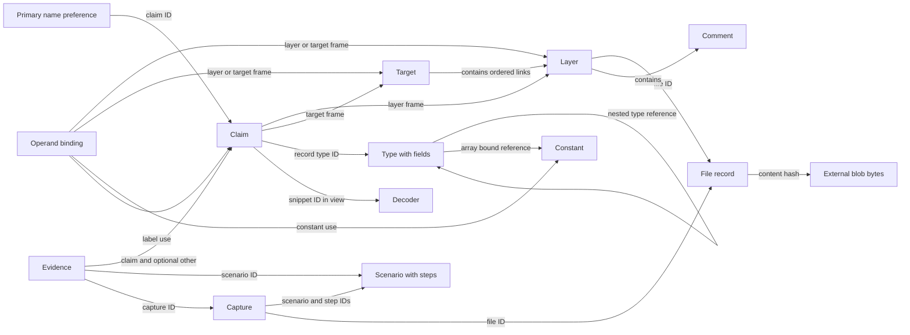
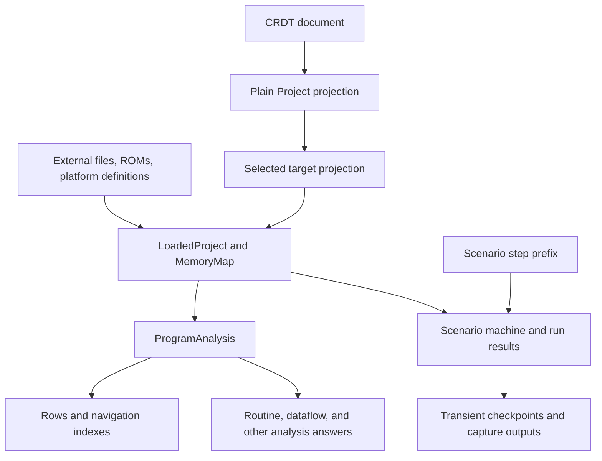

**re64 document model — architecture review report**

Reviewed against commit `f5b2720b38075edc96d851d42d73ae7afc277a13` on 2026-09-14. This is an inventory of the implemented document and its architectural surroundings. It covers structure, relationships, scope, and lifecycle; it does not catalogue operations or API commands. Source links point to the corresponding implementation in this checkout.

**1. The document is the replicated project state.**

`CrdtDoc` is an alias for `Y.Doc`. The CRDT adapter represents the document as named roots containing maps, arrays, and ordinary values. Domain consumers use plain `Project`, `LoadedProject`, and analysis objects. One document belongs to one project; its targets are views within that document, not separate documents or replication partitions. A replica holds the entire document, including declarations for targets it is not currently viewing.

Three representations have different boundaries:

| Representation | Contents | Architectural role |
|---|---|---|
| CRDT document | Program declarations, chat, participant membership, and CRDT history/identity metadata | State held by replicas and preserved through binary updates and snapshots. |
| `Project` projection | Program declarations and chat as `messages`; no participant membership or CRDT internals | Plain data for loading, export, and comparison. The `.re64` text is an export of this view, with formatting handled separately. |
| Program projection | `Project` without `messages` | Input to the public document-content version. Membership is already absent from `Project`. |

The public version is the first 12 hexadecimal characters of a SHA-256 hash of the serialized program projection. It is not the CRDT state vector, an update-log cursor, or an execution fingerprint. Two documents can have the same public version while having different conversation, membership, or CRDT history.

The store restores a document from a snapshot and subsequent updates. Text supplies the initial state only when no CRDT snapshot or updates exist. Browser replicas start empty and receive CRDT state from the server. Server-hosted session replicas are seeded from the room's document. Older comments describing JSON as canonical for each session are superseded by this implementation.

Sources: [document construction and projections](../src/core/crdt/doc.ts), [store loading and version](../src/store/project-store.ts), [browser document client](../src/client/doc-client.ts), [server replica construction](../src/server/index.ts).

**2. Storage notation and identity apply across the inventory.**

In the tables below, `Map<T>` means a `Y.Map<T>` with string keys, `Array<T>` means `Y.Array<T>`, and `Entry` means `Y.Map<unknown>`. An ordinary `T[]` is a plain value inside an entry, not a nested CRDT array. `Address` means `number | string`, normally a number or a hexadecimal spelling such as `"$8000"`. A `?` marks an optional property. Timestamps are numbers representing Unix milliseconds.

Most entities have an `id` stored inside the entry as well as used as its collection key. The exported TypeScript interfaces generally declare `id?: string` for legacy input compatibility; current entities are identified by stable IDs. Names, positions, and offsets are editable properties. New IDs use prefixes such as `lay`, `fil`, `clm`, `cmt`, `cst`, `typ`, `fld`, `tgt`, `lnk`, `scn`, `stp`, `cap`, `evd`, `dec`, and `msg`. Older labels and regions can retain `lbl` and `rgn` IDs after becoming claims.

This is an application schema over permissive maps, not a closed runtime schema enforced by Yjs. Several constructors copy unknown properties, and the projection preserves extra entry properties. The inventory lists the supported fields, rather than claiming that arbitrary or older document content cannot contain others. `meta` is projected through an explicit whitelist.

Below the application roots, the document also contains CRDT structural history. This belongs to replication, rather than the re64 domain schema:

| CRDT constituent | Composition | Scope and lifecycle |
|---|---|---|
| Shared-type structure | Named roots, nested shared types, item identities, and ordering/parent relationships | Describes the maps and sequences in the inventory. An item's CRDT identity is distinct from the `id` string in its application record. |
| Struct history and deletion information | Items identified by originating client ID and logical clock, including retained deleted content | Carried by CRDT binary state/updates. `gc: false` preserves deleted content; the live JSON projection does not expose it. |
| Local document context | Current writer client ID, configuration, listeners, and runtime bookkeeping | Belongs to a particular `Y.Doc` instance. It is not a replicated user/session record. The adapter reserves client ID `0` for deterministic initial construction; replicas have their own runtime writer identities. |
| State vector | Encoded summary of per-client progress | Derived from CRDT history for synchronization. It is not an application root or the public program version. Attribution requires the external association between CRDT client IDs and sessions/users. |

Sources: [identity](../src/core/project/identity.ts), [project types](../src/core/project/project.ts), [map construction and field projection](../src/core/crdt/doc.ts).

**3. There are 16 application roots.**

Fifteen are declared by the document adapter; `participants` is managed by the membership adapter and is created/accessed separately. Optional collections can be empty. An absent optional collection in exported JSON does not establish that the CRDT never held it.

| Root | Physical type and key | Composition | Purpose and scope |
|---|---|---|---|
| `meta` | `Map<unknown>`, fixed property names | `name?: string`, `description?: string` | Project identity in prose; project-wide. No stored project database ID, selected target, or public version. |
| `layers` | `Array<Entry>`, ordered | Layer properties and nested annotation maps | Project's declared byte resources and compatibility symbol layers. Order is retained; explicit targets define their own link order. |
| `files` | `Map<Entry>`, file ID | `ProjectFile` | Project-local identity and metadata for external immutable content. |
| `targets` | `Map<Entry>`, target ID | `ProjectTarget`, including plain link and entry-point lists | Named arrangements of layers and entry points. All targets are replicated together. |
| `claims` | `Map<Entry>`, claim ID | Flat `ProjectClaim` | Names, interpretations, and roots, optionally scoped to a layer or target. |
| `primaryLabels` | `Map<string>`, address string | Claim/label ID as the value | Project-wide preference for a displayed name at an address. |
| `constants` | `Map<Entry>`, constant ID | `ProjectConstant` | Names for values, independent of byte ownership. |
| `constantUses` | `Map<Entry>`, framed site | `ProjectConstantUse` | Which constant an operand site means. |
| `labelUses` | `Map<Entry>`, framed site | `ProjectLabelUse` | Which named claim an operand site means. |
| `decoders` | `Map<Entry>`, decoder ID | `ProjectDecoder` | Shared source for interpreting bytes. |
| `types` | `Map<Entry>`, type ID | Type properties and an ID-keyed nested field map | Shared record layouts. |
| `scenarios` | `Map<Entry>`, scenario ID | Scenario properties; `steps` encoded as a JSON string | Repeatable machine workflows. |
| `captures` | `Map<Entry>`, capture ID | `ProjectCapture` | Durable references to selected outputs of scenario runs. |
| `evidence` | `Map<Entry>`, evidence ID | `ProjectEvidence` | Support, refutation, and retirement attached to claims. |
| `chat` | `Array<Entry>`, ordered; each message also has an ID | Message scalar properties | Project conversation; projected as `Project.messages`. |
| `participants` | `Map<Entry>`, session ID | Participant scalar properties | Project membership history and online state; excluded from `Project` and `.re64`. |

There is no root-level `comments`, `labels`, `regions`, `links`, `fields`, or `steps` collection. Their relevant representations are nested or derived, as detailed below. No application root uses `Y.Text`; prose, source code, and message text are string values.

Sources: [root declarations and construction](../src/core/crdt/doc.ts), [membership root](../src/core/crdt/participants.ts), [chat root](../src/core/crdt/chat.ts).

**4. Layers describe resources and retain layer-owned comments.**

Each layer is one map in the ordered `layers` array. Its supported properties are:

| Property | Type | Meaning |
|---|---|---|
| `id` | `string` | Layer identity, referenced by links, claims, and bindings. Optional only at legacy input boundaries. |
| `type` | `"prg"`, `"raw"`, `"bytes"`, `"symbols"`, or `"rom"` | Resource kind. |
| `name?` | `string` | Display name; a loaded name can be derived when absent. |
| `file?` | `string` | ID of a project file for file-backed content. |
| `member?` | `string` | Member selector within a D64 file; not a separate file identity. |
| `path?` | `string` | Legacy import path; current file identity separates this into `file` and, where needed, `member`. |
| `address?` | `Address` | Declared placement: needed for raw/inline bytes; optional PRG override. A target link can supply a placement. |
| `bytes?` | `string` | Inline hexadecimal byte pattern for `bytes` layers. This content actually is inside the document. |
| `length?` | `number` | Declared span length where supported, including repeat/truncation of an inline byte pattern. |
| `noAutoEntry?` | `boolean` | Whether a PRG contributes its automatic entry point. |
| `rom?` | `"basic"`, `"kernal"`, or `"characters"` | Which host-provided machine ROM is requested. |
| `reference?` | `boolean` | Intent that bytes support resolution without occupying the rendered listing range; ROMs default to this. See implementation qualification below. |
| `comments` | `Map<Entry>`, comment ID | Current layer-owned comments. |
| `labels` | `Map<Entry>`, label ID | Compatibility representation of legacy labels; normally empty after text-to-claims migration. |
| `regions` | `Map<Entry>`, region ID | Compatibility representation of legacy regions; normally empty after text-to-claims migration. |
| `constantUses?`, `labelUses?` | `Map<Entry>`, normalized absolute site | Legacy nested operand bindings, retained where migration lacks placement information. |

The five resource kinds differ in their content dependency:

| Kind | Content and placement | Scope/lifecycle |
|---|---|---|
| `prg` | External file bytes, normally with a two-byte load-address header; may select a D64 member | Declaration survives independently of loaded memory. Its bytes and selected placement produce a loaded file layer. |
| `raw` | External file bytes plus declared address and optional length | Same project lifetime as the declaration; loaded view depends on the target. |
| `bytes` | Inline hex bytes, address, optional repeated/truncated length | Both declaration and byte pattern travel in the CRDT. |
| `symbols` | No bytes; compatibility container for annotations | Retained by target projection even though it is not a byte-bearing target link. |
| `rom` | ROM kind in the document; bytes on the host | A missing ROM produces a byte-less loaded layer and a missing-ROM report. The declaration remains present. |

A nested comment has `id?: string`, `address: Address`, `placement?: "before" | "inline" | "after"`, `text: string`, and `order?: number`. Placement defaults to `before`; `order` arranges comments sharing an address. These are comments about locations, distinct from claim descriptions, evidence notes, and chat. They live with their layer, but their stored address is absolute: the current loader does not relocate comments by adding a target-link offset.

The compatibility objects are fully representable as follows:

| Object | Fields | Status |
|---|---|---|
| Legacy label | `id?: string`, `address: Address`, `name: string`, `type?: "entry" \| "function" \| "code" \| "address"`, `extent?: number`, `comment?: string` | Converted to a root-level claim on text import; an embedded comment becomes a separate comment. |
| Legacy region | `id?: string`, `start: Address`, `end: Address`, `kind`, `encoding?: TextEncoding`, `name?: string`, `comment?: string`, `view?: string` | `end` can be an exclusive endpoint or legacy `"+length"`. Historical kinds include `code`, `data`, `text`, `jumptable`, `bitmap`, and `unknown`; the surviving `ProjectRegion.kind` annotation is narrower (`LayerDefault`). Current interpretations belong to claims. |
| Legacy constant use | `id?: string`, `address: Address`, `constant: string` | Constant ID at an absolute site in the enclosing layer. |
| Legacy label use | `id?: string`, `address: Address`, `label: string` | Label/claim ID at an absolute site in the enclosing layer. |

Text import migrates populated legacy labels/regions into claims. Snapshot restoration does not call that constructor; the current document migration handles files, fields, bindings, and root entry points, so older snapshots can still contain legacy annotation maps. Legacy bindings become root-level layer-relative bindings only when the original layer placement is known; unresolved ones remain nested.

Sources: [layer and annotation schemas](../src/core/project/project.ts), [CRDT nesting and migration](../src/core/crdt/doc.ts), [claims migration](../src/core/claims/migrate.ts), [resource loading](../src/core/project/loader.ts), [loaded layer types](../src/core/memory/layer.ts).

**5. Files, targets, and links separate content identity from placement.**

| Object | Fields and physical representation | Purpose, scope, and lifecycle |
|---|---|---|
| File | `id?: string`, `name: string`, `hash?: string`, `size?: number`; one entry under `files[id]` | Project-local reference to content. `hash` is the full SHA-256 content hash; `size` counts bytes. Both may be absent on unresolved legacy imports. Names can be duplicated and are not references. Layers and captures reference the ID. Binary bytes are held separately and can be shared by multiple file records. |
| Target | `id?: string`, `name: string`, `layers: (string \| ProjectLink)[]`, `entryPoints?: Address[]`, `order?: number`, `description?: string`; one entry under `targets[id]` | A named arrangement of resources. The link list is bottom-up, with later links shadowing earlier ones. Entry points belong to this arrangement. `order` describes its position in the program's phases and supports display ordering. |
| Link | `id?: string`, `layer: string`, `at?: Address`; plain object inside a target's `layers` list | Relationship between one target and one layer, optionally at a different address. Bare layer-ID strings are also accepted and mean the layer's declared placement. A link is not an independent root or nested Yjs map. Its storage lifetime is within its target. |

The target's `layers` and `entryPoints` are plain array values in its map. Although links have identities in the model/API, the CRDT does not give each link an independently keyed child map. This differs from type fields.

No current document field chooses the target being viewed. Selection belongs to a browser session or a workspace/request. When no targets are declared, the loader can derive an implicit arrangement from layer declaration order. That synthesized object is not evidence that a target was already stored. Legacy root-level entry points are migrated into a target; the `Project.entryPoints` used by analysis is the selected target's projected list.

Sources: [file and target schemas](../src/core/project/project.ts), [file identity normalization](../src/core/project/files.ts), [target projection](../src/core/project/loader.ts), [target storage](../src/core/crdt/ops.ts), [content hashing](../src/store/blobs.ts).

**6. Claims are the central interpretation objects.**

A claim is one independently identified entry in `claims`. It can name a point, describe a span, or identify a root. Several claims may coexist at the same position or cover the same bytes. The stored claim is flat:

| Property | Type | Purpose |
|---|---|---|
| `id` | `string` | Stable claim identity, including migrated label/region IDs. |
| `at` | `Address` | Position in its stored frame. |
| `extent?` | `number` | Byte count. Absence means a point. End is derived, not another field. |
| `layer?` | `string` | Layer ID; makes `at` an offset into that layer's bytes. |
| `target?` | `string` | Target ID; makes `at` an absolute address meaningful in that arrangement. |
| `name?` | `string` | Name for the point or span. Anonymous claims are possible. |
| `is?` | `"data"`, `"text"`, `"bitmap"`, `"jumptable"`, or `"record"` | Interpretation of bytes. Neither `code` nor `unknown` is an interpretation member. |
| `encoding?` | `"ascii"`, `"petscii"`, or `"screen"` | Text interpretation parameter. |
| `view?` | `string` | Text/bitmap decoder or display specification, including `char:8`, `bits:3`, `sprite`, and `snippet:<decoder-id>`. |
| `typeId?` | `string` | Record layout ID when `is` is `record`. |
| `root?` | `"entry"`, `"routine"`, `"location"`, or `"data"` | Explicit reason to surface a location independently of reachability. The first three are code roots; `data` surfaces data. |
| `description?` | `string` | Meaning of the name/claim in prose; separate from address commentary. |
| `origin?` | `"user"`, `"layer"`, `"platform"`, `"auto"`, or `"analysis"` | Classification of the claim's source. Missing origin becomes `user` in the domain view. |

The logical frame is one of `{space:"layer", layer}`, `{space:"target", target}`, or `{space:"address"}`. The document flattens it into `layer`/`target` fields. A layer frame takes precedence when decoding; neither field means an absolute/address frame. The intended current scoping is a byte-owning layer or an explicit target, but unframed claims remain representable and occur in compatibility paths and implicit arrangements. The stronger older comment that every project claim must have a layer/target frame is not a complete description of accepted state.

The logical `Interpretation` is likewise derived from the flat fields: `{is:"data"}`, `{is:"jumptable"}`, `{is:"text", encoding?, view?}`, `{is:"bitmap", view?}`, or `{is:"record", typeId}`. The loaded `Claim` has numeric absolute `at`, structured `frame` and `says`, and a resolved `origin`. It is a view of the stored claim, not an additional document entity.

Layer-framed claims travel to the selected layer placement. Target-framed claims are applicable only to that target. Retirement is derived from live evidence with kind `retires`; the claim remains in the document and export, while the loaded working claim list excludes it. Refutation alone does not retire a claim. Author, method, and timestamp belong to evidence, not to the current claim record. A claim has no stored confidence score, retirement flag, routine body, control-flow graph, or resolved winning interpretation.

Sources: [stored claim schema](../src/core/project/project.ts), [domain claim and frame types](../src/core/claims/model.ts), [claim encoding](../src/core/crdt/claims.ts), [claim applicability and retirement](../src/core/project/loader.ts).

**7. Name preferences and operand bindings express relationships between interpretations.**

| Object | Composition | Scope and dependency |
|---|---|---|
| Primary label preference | `primaryLabels[addressString] = claimOrLegacyLabelId` | One preferred name per absolute address across the project. It has no entity ID or layer/target frame. A missing referenced name falls back to the normal ranking. |
| Constant | `id?: string`, `name: string`, `value: Address` | Project-wide named 8-bit value. Distinct constants may name the same value. |
| Constant use | `id?: string`, `at: Address`, `layer?: string`, `target?: string`, `constant: string`; legacy `address?: Address` accepted as input | Operand site referring to a constant ID. The frame determines whether `at` is a layer offset or absolute address. A missing constant falls back to a literal. |
| Label use | `id?: string`, `at: Address`, `layer?: string`, `target?: string`, `label: string`; legacy `address?: Address` accepted as input | Operand site referring to a particular named claim/legacy label ID. A missing label falls back to normal primary-name resolution. |

Uses are keyed by their framed site, not by their own `id`. Examples are `layer:lay_abc123:$0123`, `target:tgt_abc123:$8123`, and `address::$8123`. One site's entry in `constantUses` is independent of the entry at that site in `labelUses`. A frame is part of the key so two arrangements or layers do not collapse merely because their numeric positions match.

The binding site identifies the referring instruction/operand site; the reference names what it means. It is not a stored cross-reference index. Applicability and resolution at absolute sites are derived for each loaded target, including layer precedence. Unlike framed claims and uses, `primaryLabels` remains an absolute, project-wide mapping and does not automatically express a separate preference for each target or relocated instance.

Sources: [binding schemas and site keys](../src/core/project/project.ts), [name resolution](../src/core/claims/names.ts), [constant index](../src/core/memory/constant.ts), [loaded bindings](../src/core/project/loader.ts).

**8. Types and decoders are project-wide definitions used by claims.**

| Object | Fields | Physical composition and lifecycle |
|---|---|---|
| Type | `id?: string`, `name: string`, `size: Address`, `unit?: "bytes" \| "bits"`, `fields` | One map under `types[id]`. `size` is bytes per record, even for bit layouts. Size is declared because holes in a layout are valid. No byte ownership or selected target is stored. |
| Field | `id?: string`, `offset: number`, `name: string`, `type: string`, `description?: string` | `types[id].fields` is a `Map<Entry>` keyed by field ID. Each field property is a separate map value. The exported form is a list ordered by offset and ID. A field lives within its parent type. |
| Decoder | `id?: string`, `name: string`, `source: string` | One map under `decoders[id]`. Source is a function body accepting bytes and parameters and returning decoded data. Compiled functions, workers, parameters supplied for a run, and results are outside the document. |

A field offset counts the parent type's units, defaulting to bytes. Field type is stored as one string; the parsed discriminated union is derived:

| Stored spelling | Derived composition |
|---|---|
| `u8`, `i8`, `u16`, `u16be`, `ptr`, `ptrbe` | Scalar `FieldType` with the corresponding `is` discriminator. Pointer types carry address meaning as well as byte width. |
| `char(n)` or `char(n,encoding)` | `{is:"char", length, encoding?}`; encoding is ASCII, PETSCII, or screen code. |
| `bytes(n)` | `{is:"bytes", length}`. |
| `bits(n)` | `{is:"bits", width}`; supported widths are 1–32, intended for bit-unit records. |
| Type ID, with legacy unique-name aliases accepted | `{is:"record", typeId}`; references another project type. |
| Element spelling followed by `[n]` or `[first..last]`, with nesting allowed | `{is:"array", of: FieldType, count, origin?, countId?}`. Bounds can reference declared constants. Current stored references use IDs, e.g. `u8[cst_abc123]`. `u8[4][8]` means four arrays of eight. |

Record counts at a claim are derived from claim extent and type size. Array counts may depend on a constant value. Field sizes, paths into nested records, interpreted values, and pointer references are derived from the layout and bytes. Two field IDs may share an offset in the document; the loaded offset-keyed layout selects one and hygiene can report the overlap.

Sources: [stored types and decoders](../src/core/project/project.ts), [nested CRDT fields](../src/core/crdt/doc.ts), [field grammar and domain types](../src/core/memory/type.ts), [type projection](../src/core/project/loader.ts), [decoder result types](../src/core/view/bitmap-view.ts).

**9. Scenarios, captures, and evidence preserve reproducible reasoning.**

A scenario contains `id?: string`, `name: string`, `description?: string`, and `steps: ProjectStep[]`. In the CRDT, `steps` is a single JSON-encoded string. Step IDs identify elements within the scenario for captures and reporting; they do not correspond to independent CRDT entries. A scenario declaration has no stored selected-target field or machine state. Its execution receives a target through its surrounding view.

Every step has `id?: string` and a `kind` discriminator. The complete stored step vocabulary is:

| Kind | Additional fields | Meaning of the stored specification |
|---|---|---|
| `start` | `at: Address`, `vector?: boolean` | Starting address, optionally interpreted as a vector location. |
| `set` | `registers?: Record<string, number>`, `memory?: Record<string, number>` | Register or memory state specified by the workflow. |
| `input` | `port: 1 \| 2`, `up?`, `down?`, `left?`, `right?`, `fire?` (booleans) | Joystick state, held until another specification changes it. |
| `key` | `keys: (string \| number)[]` | Held keyboard keys, named or represented by matrix codes; an empty list means none held. |
| `run` | `frames?: number`, `cycles?: number`, `breakpoints?: Address[]`, `watchpoints?: {from: Address, to: Address, on?: "read" \| "write" \| "any"}[]`, `leaves?: boolean`, `maxInstructions?: number` | Execution bounds and stopping conditions. |
| `assert` | `memory?: Record<string, number>`, `registers?: Record<string, number>`, `note?: string` | Expected state and explanation. The assertion result is not stored in this step. |
| `capture` | `what: CaptureKind`, `from?: Address`, `to?: Address`, `count?: number`, `every?: number`, `name: string` | Output specification; range applies to RAM, count/spacing to frame sequences. |

Here `CaptureKind` abbreviates the union `"ram" | "screen" | "frames" | "trace" | "sid" | "devices"` used in both steps and capture records; it is report notation, not a separately declared source type.

| Object | Stored fields | Relationships and lifecycle |
|---|---|---|
| Capture | `id?: string`, `scenario: string`, `step: string`, `kind: CaptureKind`, `file: string`, `when?: number` | References its scenario ID, step ID, and project file ID. Retains a reference to output bytes independently of the temporary run or checkpoint. It contains no embedded output bytes or execution fingerprint. |
| Evidence | `id?: string`, `claim: string`, `kind: "supports" \| "refutes" \| "retires"`, `author?: string`, `when?: number`, `method?: ClaimMethod`, `scenario?: string`, `capture?: string`, `other?: string`, `note?: string` | An account attached to one claim, optionally pointing to a repeatable scenario, an existing capture, or another claim. Several evidence records can describe the same claim. |

`ClaimMethod` is `"guessed" | "transcribed" | "read" | "derived" | "ran"`. It describes how somebody knows, not a confidence score. Evidence provenance belongs to the account, so independent authors can support one shared claim. `other` is a claim reference; it does not create a stored ranking or replacement chain. A `retires` record makes retirement derivable without a second flag on the claim.

A capture's references establish provenance, but the record does not pin a target, scenario revision, step prefix, document version, or ROM fingerprint. A later version of its referenced scenario can therefore differ from the workflow that originally produced those bytes. The bytes themselves remain identified by the referenced file's content hash.

Sources: [scenario, step, capture, and evidence schemas](../src/core/project/project.ts), [scenario encoding](../src/core/crdt/doc.ts), [derived runs and checkpoints](../src/core/machine/scenario.ts), [evidence interpretation](../src/core/claims/evidence.ts).

**10. Conversation and membership are also document data.**

| Object | Fields | Scope and lifecycle |
|---|---|---|
| Chat message | `id: string`, `at: number`, `author: string`, `name: string`, `text: string` | One map in the ordered `chat` array. The `ProjectMessage` input type allows an omitted legacy ID. Conversation order is the array order; timestamps are supplied by the writer and do not define it. `name` records the author's display name at the time. Messages export as `messages` and are excluded from the program version. |
| Participant | `session: string`, `user: string`, `name: string`, `codename?: string`, `kind: "browser" \| "agent" \| "cli"`, `online: boolean`, `joinedAt: number`, `lastSeen: number` | One map per session in `participants`. Session ID is both the key and an entry field. Offline participants remain recorded. Name/codename may reflect later participation under the session. `lastSeen` records join/leave state changes, not a persisted cursor stream. |

Membership belongs to the project, but user accounts and session leases do not. A user can have multiple participant entries through multiple sessions. The server marks previously online participants offline when opening the sync room, so persisted online flags do not imply live connections after restart. Participant state is persisted in CRDT updates but omitted from `.re64`, public program version, and the operation-derived feed.

Ephemeral awareness is a separate transport-side structure. In current client code it carries user display name and colour, keyed by CRDT client ID; it is not the participant root. Chat text is an ordinary string, without a nested collaborative text object. Its standard posting helper limits text to 2,000 characters; this helper-level bound is not a Yjs schema constraint.

Sources: [chat](../src/core/crdt/chat.ts), [participants](../src/core/crdt/participants.ts), [awareness client](../src/client/doc-client.ts), [server membership initialization](../src/server/sync.ts).

**11. The relationships form a declaration graph, not a database foreign-key graph.**

The arrows are references or containment as labelled. Most referenced identities are strings; the CRDT itself does not enforce relational integrity or cascading lifetimes. Losing a target or layer can make a claim inapplicable without physically nesting or deleting the claim. Removing a referenced constant/type/name can leave a binding or interpretation with a fallback. A target link to a missing layer is skipped. A layer referencing a missing file is an error during loading; a missing ROM is reported while keeping the project openable. These cases have different policies and should not be treated as one universal dangling-reference rule.

Authorship strings in evidence and chat, and `participants.user`, connect the document conceptually to external identities. They are not embedded user records or CRDT-enforced foreign keys. The entity ID, CRDT client ID, user ID, session ID, and database project ID answer different identity questions.

Sources: [loader reference handling](../src/core/project/loader.ts), [claim frames](../src/core/claims/model.ts), [file sources](../src/core/project/file-source.ts), [sessions](../src/server/sessions.ts).

**12. These major objects exist outside the document.**

Some are independent durable data; others are ephemeral context. Being outside the document does not necessarily mean being derived from it.

| Object | Type/composition | Scope and lifecycle; relationship to the document |
|---|---|---|
| Binary blob | Content hash, size, `Uint8Array`/database BLOB bytes | Durable external content. File records reference it; it cannot generally be reconstructed from the document. Inline `bytes` layers are the exception. Filesystem mode reads local bytes and verifies a recorded hash. |
| Host ROMs and C64 platform definitions | ROM byte images; built-in symbols, machine/device definitions, instruction semantics | Inputs supplied by the host/codebase. ROM declarations can be in the document, but their bytes and platform tables are outside it. Equal documents on hosts with different ROMs need not produce equal execution results. |
| Database project/catalogue record | Project ID, display metadata, timestamps, export text, text revision | Identifies and locates a persisted project. The database ID and creation/update timestamps are not `meta` properties of its CRDT. Export text/revision are derived components of this record. |
| Blob-name compatibility index | Database `files` rows mapping project-local names to hashes | External storage lookup/index alongside the document's ID-keyed file registry. Current document references use file IDs/hashes; names are an index/alias concern. Its SQL name uniqueness differs from duplicate names allowed by the document. |
| User record | Database `users`: ID, name, colour | Durable external identity catalogue. A participant/message records identity strings without embedding this row. |
| Session record and live lease | Database session ID, user/project IDs, client ID, codename, timestamps; live `Lease` with ID, codename, user ID, label, client ID, last-seen time | Session attribution and liveness outside the document. A lease expires after inactivity (default 30 minutes); historical database identity records remain. |
| Caller | `Caller` with user ID, label, identity source, optional session ID/codename/shared-session marker | Request context. Determines which replica and identity a request uses; not replicated state. |
| Room and store | `Room` references store, storage, project ID/path, optional replica/target/checkpoint cache/base URL; `ProjectStore` owns its document and persistence bookkeeping | Server/process objects that contain or refer to a document. They are not roots inside it. |
| Session replica wrapper | `SessionReplica {doc, cursor, session, changed}` | One server-held replica per session and project. Only `doc` is the CRDT. Cursor and change counter are local bookkeeping. Wrapper and associated workspaces are dropped when its lease lapses. |
| Browser session and transport | `DocClient`, `ProjectSession`, websocket provider, connection status, session ID, listeners, promises | Client-local lifetime. Contains the replica, loaded state, and blob cache; not itself replicated. |
| Selected target and UI state | Browser `viewTarget`; workspace/request `target`; selections, navigation, presentation state | Reader/view scope. There is no shared selected/default-target field in the current document schema. |
| Awareness | Transport state keyed by client ID; currently user name/colour in the client | Ephemeral connection-associated state. Separate from durable participant membership. |
| Undo state, changes/history, tags | Local undo manager; durable change records with attribution/inverses/cursors; session summaries; `StoredTag {name,cursor,version,at,author?,note?}` | Outside the CRDT roots. These records preserve history or intent that cannot all be reconstructed from the current plain project. A tag names a log position and program version; it is not a document snapshot. |
| Update log and snapshot records | `StoredUpdate {seq,update: Uint8Array}`; `StoredSnapshot {seqUpto,update: Uint8Array}` | Durable encodings of CRDT state/history outside its application roots. Snapshots accelerate restoration and do not mean old content has been garbage-collected. |
| Upload ticket | `PreparedUpload {token,projectId,name,author,sessionId?,expiresAt}` | Temporary, single-use transfer context; default expiry ten minutes and lost on restart. It becomes relevant to the model through a file declaration, not by being a root itself. |

Sources: [database schema](../src/store/db.ts), [storage types](../src/store/storage.ts), [file storage](../src/store/file-storage.ts), [filesystem byte loading](../src/node-files.ts), [room and replica types](../src/server/workspace.ts), [lease management](../src/server/sessions.ts), [uploads](../src/server/uploads.ts), [client session](../src/client/session.ts).

**13. Derived objects turn declarations into answers.**

The main dependency path is:

The machine path also consumes document scenarios; a persisted capture is a later declaration referencing selected output bytes, not the checkpoint itself.

| Derived object | Composition/input | Scope and lifetime |
|---|---|---|
| Plain project and export | Sorted scalar records/lists projected from CRDT maps; chat renamed to `messages`; formatted text maintained separately | Reconstructible from CRDT content. Whitespace/grouping of an existing text export is handled by the serializer rather than stored as CRDT fields. |
| Program version and local change counters | Hash of program projection; store/replica counters | Version is a content identifier computed from a particular replica. Counters are process-local cache bookkeeping and can advance without the public version changing. |
| Target-specific project | Selected/reordered layers, link placement overrides, selected target's entry points | Derived for one view. A synthetic target may exist in this projection when none was declared. |
| `LoadedProject` | `project`, `map`, `selectedTarget?`, `prgEntries`, `userLabels`, `comments`, `claims`, `constants`, `types`, `romsMissing`, `layers` | Built from a project, file loader, ROM loader, and target. Rebuilt when relevant inputs change. Its `project` is already view-oriented, not necessarily the full unfiltered export. |
| `MemoryMap` and loaded `Layer` objects | `FileLayer`, `BytesLayer`, `SymbolLayer`; numeric start/end, byte access, reference/default-kind metadata, labels/regions, shadowing order | Target-specific resolved memory. Ownership, visible range, active bytes, and placements are computed, not separately stored document entities. |
| Loaded claims and indexes | Absolute numeric claims; `NameIndex`, `RegionIndex`, `CommentIndex`, `ConstantIndex`, `TypeIndex`; resolved uses and preferences | Derived for a loaded target. Retirement and frame filtering determine the working set. Overlapping declarations can remain in the document while consumer indexes choose a rendering. |
| Parsed record layouts | `RecordType` with numeric size and offset-keyed fields; recursive `FieldType`; counts, widths, field paths | Derived from type strings, referenced types/constants, and relevant bytes. Document field identity remains ID-based even though a loaded layout is offset-keyed. |
| Claim sets and disagreements | `ClaimSet`/`PlacedClaim` and computed disagreement/evidence views | Query/domain structures over claims. They are not extra CRDT collections. The general placement helper is separate from the main loader's placement implementation. |
| `ProgramAnalysis` | Loaded project, decode entry points, execution origins, instruction index, inbound/outbound references, basic blocks, labels/automatic labels, warnings, hygiene, lazy value and decimal-mode analysis | Derived per target/input state. Automatic names and layer/platform-generated claims are not automatically persisted merely because the API can display them. |
| Routines and effects | Routine entries, member blocks/spans, call relationships, register/memory effects, return behavior, dataflow results | Derived from instructions, blocks, roots, and machine semantics. There is no stored routine-body or call-graph object. A stored routine root supplies intent, not the computed body. |
| Rendered analysis | `AnalysisResult {rows,lineForAddress,arrows,warnings,stats}`; each row has address, kind, text, semantic tokens, optional illegal flag | Reconstructible view output. Tokens reference addresses and, where editable, stored claim IDs. Listing rows and equate/type displays are not document records. |
| Workspace caches | Cached loaded/program pair, rendered rows, routine effects, projection/counter bookkeeping | One workspace per session/project/target on the server. Memory-only; discarded with the workspace/process and replaced when its key changes. ROM contents participate in freshness. |
| Browser loaded state and blob cache | `LoadedProject`; `Map<string, Uint8Array>` keyed primarily by content hash | Browser-session lifetime. Missing referenced blobs are fetched separately. On failed rebuild the current implementation retains its last successful loaded model. Cached bytes are copies of independent external content, not synthesized from declarations. |
| Compiled decoder cache | Module-level map from source string to function or failed-compilation marker | Derived from stored source; realm/process lifetime with an explicit clearing mechanism. Decoder results (`Decoded`: bitmap, frames, or text) are transient results unless separately retained. |
| Machine and run result | C64 RAM/registers/device state; `ScenarioRun` with per-step descriptions, checks, optional overall pass result, output captures, outcome, warnings | Derived from selected memory, ROM/device semantics, and scenario steps. No live emulator state or assertion result is a scenario field. |
| Scenario checkpoints | Machine memory/registers/devices, cycles/instruction count/PC, plus accumulated descriptions, checks, captures, warnings, outcome | In-memory, per-project LRU cache, default limit eight. Key combines execution fingerprint and serialized step prefix. Fingerprint includes program version, selected target ID, placed layer spans/order, and relevant ROM content. Lost on restart; a miss permits reconstruction. |
| Transient capture output | `Capture {step,kind,name,bytes,frames?}` | A run result. Distinct from stored `ProjectCapture`, whose bytes live in a file/blob. Persisted capture artifacts can outlive all checkpoints. |

Sources: [loader](../src/core/project/loader.ts), [memory map](../src/core/memory/memory-map.ts), [claim sets](../src/core/claims/set.ts), [program analysis](../src/core/analysis/program.ts), [routines](../src/core/analysis/routines.ts), [rendered rows](../src/core/view/rows.ts), [workspace caches and execution fingerprint](../src/server/workspace.ts), [client state](../src/client/session.ts), [compiled decoders](../src/sandbox/sync.ts), [scenario cache](../src/core/machine/scenario.ts).

**14. Lifecycle and implementation qualifications matter when interpreting this inventory.**

Application entities are project-lived declarations unless they are structurally children, such as fields, links, steps, and comments. Their ordinary disappearance from a projection is different from erasing CRDT history. All persistent project documents are created with `gc: false`; deleted content remains available in CRDT history. Snapshotting and finishing a store session do not discard the update history in the current implementation. Participant records also remain after going offline. The in-memory document instance can be discarded while its persisted logical history remains.

Browser replicas follow incoming server synchronization. Server-hosted session replicas can represent an older view of other sessions' work while including their own contributions; their analysis and version refer to that replica. A room/store's document, a session's document, a selected target, and a cached analysis therefore have related but different scopes and lifetimes.

The following qualifications are visible in the implementation and should be retained during architecture review:

| Area | Current qualification |
|---|---|
| Chat and cache freshness | Public versions use the program-only projection. Browser change detection also uses it, but `refresh()` records the full project projection. Server `Workspace.key()` currently compares the full project projection. Consequently the comments promising that conversation never causes analysis invalidation are stronger than the implemented checks. |
| Link identity versus CRDT composition | Link IDs exist, but links remain values inside a target's whole-list property. Their merge granularity is not the same as ID-keyed nested type fields. Scenario steps likewise remain a whole-list value. |
| Layer relocation | Claims and root-level bindings resolve layer offsets. Layer comments retain absolute addresses. The loader records one start per layer ID, so it should not be described as expanding every claim to every repeated placement of that layer within one target. The separate `ClaimSet.place` helper has broader placement support. |
| Reference layers and ROM placement | The stored layer schema allows `reference` generally. The current loader passes it to ROM `BytesLayer` construction; other layer branches do not consistently apply it. ROM placement uses fixed machine addresses rather than generic link address overrides. |
| Current schema versus old prose | Comments still describe targets keyed by name, fields without IDs, chat outside exports, and session documents as temporary derivatives of canonical JSON. The executing encoders, loader, store, and field declarations establish the current boundaries used here. |
| Presence of an ID | An API-visible ID does not establish that an object is a stored entity. Automatic/platform claims and many analysis results are derived; a link or step may have an ID without its own CRDT map. |

These are observations about the reviewed commit, not changes proposed or made by this report. Validation used source tracing plus the existing document, chat, participant, file-identity, and server-replica suites: **5 test files, 61 tests passed**. This validates selected boundaries; it is not a claim that every schema combination or architecture property has been tested.
